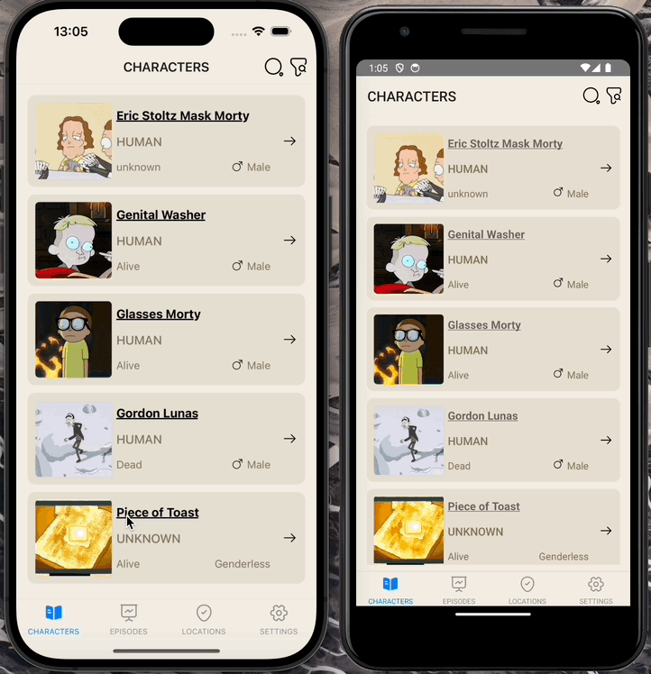

Rick and Morty Characters App

This project is a React Native application that lists and shows details of characters from the Rick and Morty series. The app offers features such as listing characters, searching, filtering, and viewing character details.

Features

Listing characters
Viewing character details
Searching characters by name
Filtering characters by gender and status
Technologies Used

React Native
Redux
Axios
React Navigation
Rick and Morty API
Character Listing
Upon opening the app, characters from the Rick and Morty series will be displayed. You can scroll through the list to see more characters.

Character Search
Use the search bar at the top of the screen to search for characters by name.
Perform the search by clicking the search button or pressing the "Enter" key on the keyboard.
Character Filtering
Filter characters based on gender (male, female, unknown) and status (alive, dead, unknown).
Use the filter buttons to apply these criteria.
Character Details
Click on a character from the list to navigate to their detail page.
On the detail page, you can view information such as the character's name, gender, species, status, origin, and current location.
API

This project utilizes the Rick and Morty API. For more information, visit the Rick and Morty API Documentation.

## Ekran Görüntüsü

